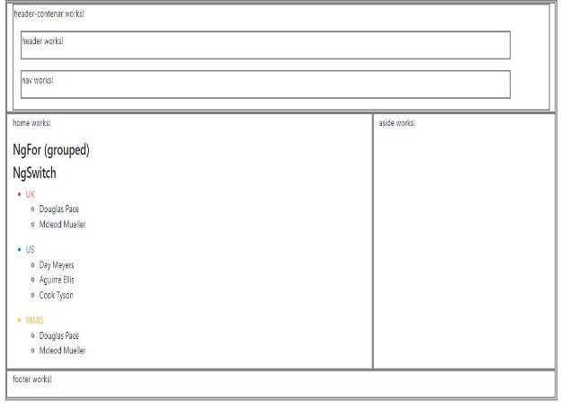

**Task Requirements**

1-  Install latest version Node , Then use npm to install angular cli 

2-  Create new angular application my-app 

3-  Create Components  header-container,  header, nav ,home ,aside  ,footer  

1. Header component and  nav component view both inside  header-container component 
1. Add logo(img) to header component and use string Interpolation to add img src 

4-  Add bootstrap from npm to your app and use it to style your component  

Use npm I bootstrap 

